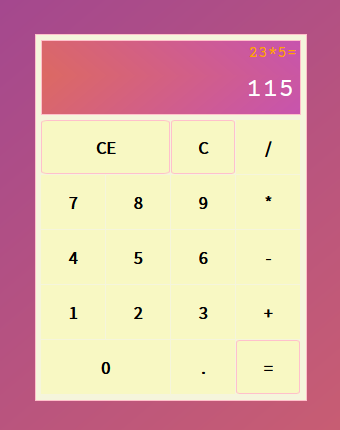

# react-calculator

esse é um [projeto sugerido](https://www.freecodecamp.org/learn/front-end-libraries/front-end-libraries-projects/build-a-javascript-calculator) pela [freeCodeCamp](https://www.freecodecamp.org/) para a obtenção da certificação de Front End Libraries.

escolhi desenvolvê-lo em ReactJS, e segui as user stories pontuadas na sugestão do projeto como diretrizes.

# você pode vê-lo funcionando em seu browser clicando [aqui](https://codepen.io/fabiokannenberg/full/yLVrNrK).

